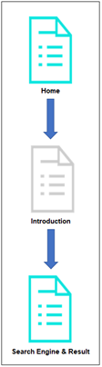
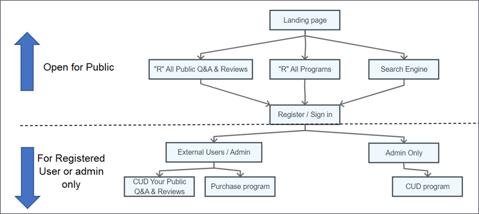
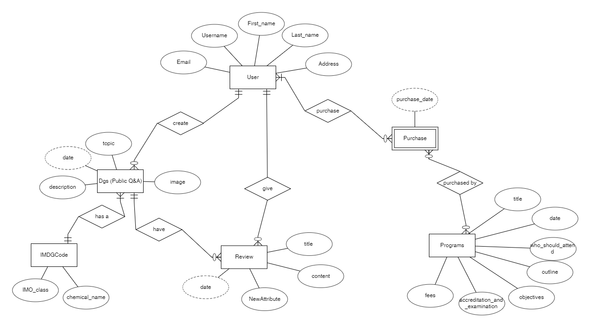
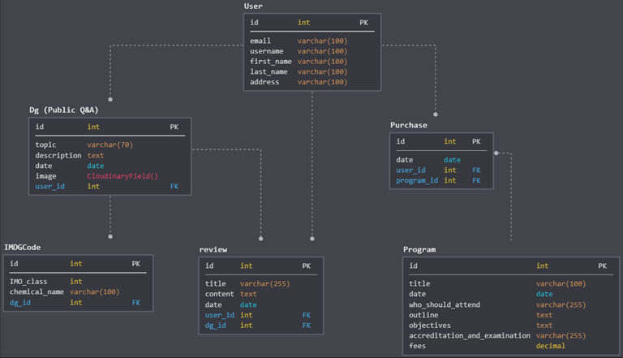

# DGExpect
View the live project <a href="https://shyan-tgc-pro4.herokuapp.com/" target="_blank">here</a>.

This is a Free <b><u>Dangerous Goods</u></b>, (hereafter known as <b><i>"DG"</i></b>) Public Q&A site and we promote training program.  

<strong>Purpose:</strong>
* In this project, I build a full-stack site based around business logic used to control a centrally-owned dataset. I set up an authentication mechanism, provide a Free Public Q&A platform and paid access to the site's training program.

<strong>Value provided:</strong>
* By authenticating on the site, users can enjoy the free <b><u>Create, Read, Update & Delete</u></b>, (hereafter known as <b><i>"CRUD"</i></b>) Public Q&A and give review. To advance users' own goals, users paying for training program to upgrade their skill. Before authenticating, the site makes it clear how those goals would be furthered by the site. 
* The site owner is able to make money by providing this set of services to the users. There is no way for a regular user to bypass the site's mechanisms and derive all of the value available to paid users without singup or paying.

<a href="https://shyan-tgc-pro4.herokuapp.com/" target="_blank"></a>


# User Experience - User Interface (UX-UI)
## 1) STRATEGY
* <strong>External user’s goal: </strong>To join a DG Public Q&A community and purchase training program

* <strong>Site owner's goal : </strong>
    * Build an active community discusssion site around the product based on site admin or users free signup to CRUD Q&A and review 
    * Sell DG Training program 

* <strong>Target audience : </strong>
    * Consumer-to-business 
    * Traveller, Trader, Career change, airport or seaport staff & Freight Forwarder

* <strong>Therefore, the site should focus on :</strong>
    * Community
        ```
            ● Design a front end for a full stack application following the principles of UX design which meets accessibility guidelines, is easy to navigate and allows the user to find information and resources intuitively
            ● Design a full stack application that lets the user initiate and full control actions and gives immediate and full feedback on information
            ● Implement a full stack application whose purpose is immediately evident to a new user and which provides a good solution to the user’s demands and expectations
            ● which has a clear, well-defined purpose addressing the needs of multiple related target audiences
            ● Free Public Q&A & reviews 
            ● All CRUD actions are immediately reflected in the user interface
        ``` 
    * E-commerce
        ```
            ● Authentication and authorisation mechanism for user and administrators
            ● A puchase payment model
        ```

## 2) SCOPE
### Identifying External Users:
* The primary purpose of this site is to allow users to share their experience, problem facing or any inquire about handling of DG product. and benefit from having convenient access to the information provided by all other members. The person may be the <b><u>site owner, traveller, trader, people seek for career change, airport or seaport staff & Freight Forwarder</u></b> (hereafter known as <b><i>"EXTERNAL USERS"</i></b>). 

### Identifying Site Owner:
* The site owner advances their own goals by providing this functionality, potentially by being a regular external user themselves. The site owner also benefit from the collection of the dataset as a whole and program training fee. 

### 2a) User Stories 
```
    ● US1. As an external user, I want to get the information easily within few clicks, so that I get what I wanted as soon as possible. 
    ● US2. As an external user, I want to visit a responsive website, so that I can surt the net at anytime anywhere easily without rely on computers.
    ● US3. As an external user, I want to visit a good user interactive website, so that i feel it is a trustworthy website to fish information. 
    ● US4. As an external user, I want to get the information easily within a particular domain, so that it save my memory & time. 
    ● US5. As an external user (Traveller), I want to have more information or suggestion on certain product, so that I know whether should I buy it during travelling.  
    ● US6. As an external user, I want to have a "any keyword" search engine, so that I can find the information easily.
    ● US7. As an external user, I want to share my experience, problem facing or any inquire about handling of DG product within the particular domain, so that I have a clear picture what to do next.
    ● US8. As an external user, I want to share my knowledge for those who needs by giving reviews, so that I can improve myself at the same time. 
    ● US9. As an external user, I want my post or review can be updated or deleted anytime by myself, so that I can do any adjustment immediately. 
    ● US10. As an external user, I want to upgrade my DG knowledge & handling skill, so that I can reach next level in my career path or career change. 
    ● US11. As an Site Onwer, I want to collect data information through this site, so that I can develop it to other businesses in future. 
    ● US12. As an Site Onwer, I want to have a program sign up section, so that I can sell my program and the payment transaction complete through the site.
```

### 2b) Functional Requirement (FR)					
| User Stories | FR |	Functional Requirement (FR)  |			
|     :---:    |     :---: |:---       |					
| US1 |	FR1 |	FixedTop Navigation that all resources are easy to find, allowing users to navigate the layout of the site intuitively.   |	
| US2 |	FR2 |	Responsive design  |	
| US6 |	FR3 |	Search Engine by input any keyword or IMDG Code category  |	
| US7 & 9 |	FR4 |	Allow users to CR Public Q&A to share their experience, problem facing or any inquire about handling of DG product & related image |	
| US8 & 9 |	FR5 |	Allow users to CR Review to share their knowledge & experience for giving help to those who needs |	
| US7 ~ 9 |	FR6 |	Only allow the same users to see, click & access UD button for their own Public Q&A & Review |	
| US11 | FR7 |	Allow users to free sign up, identify and apply authorisation, authentication and permission features for Site Onwer to collect user data information |	
| US12 | FR8 |	Allow users to purchase training program on site |  
| US12 | FR9 |	Only allow the Site admin to see, click & access CUD button for programs site |	

### 2c) Content Requirement (CR)			
| User Stories | CR |	Content Requirement (CR)  |			
|     :---:    |     :---: |:---       |			
| US3 |	CR1 |	User interactions design  |	
| US4 |	CR2 |	A short & quick introduction to attract more users to CRUD their experience, inquiry & review  |	
| US5 |	CR3 |	View Public Q&A + image & review section |	
| US6 |	CR4 |	Search Engine section |	
| US7 & 9 |	CR5 |	CRUD Public Q&A section  |	
| US8 & 9 |	CR6 |	CRUD Review Section  |	
| US10 |	CR7 |	"R" View program section   |	
| US11 |	CR8 |	Authentication and authorisation mechanism for users and administrators section |	
| US12 |	CR9 |	Shopping cart & payment section   |	
| US12 |	CR10 |	CUD program section   |


## 3) STRUCTURE				
### 3a) Information Architecture				
#### Image required				
Image required on the website to fulfill the content requirements.				
| US |	CR |	CI |	Content Inventory (CI)  |	
|     :---:    |     :---: |     :---:    |:---       |	
| US4 |	CR2 |	CI1 |	Site introduction image  |	
				
#### Content Inventory (CI)				
Information required on the website to fulfill the content requirements.				
				
| US |	CR |	CI |	Content Inventory (CI)  |	
|     :---:    |     :---: |     :---:    |:---       |	
| US4 |	CR2 |	CI2 |	A nice & short sentences to introduce the site  |	
| US5 |	CR3 |	CI3 |	"R" View all Public Q&A with image section |	
| US5 |	CR3 |	CI4 |	"R" View a Public Q&A details with image & its' reviews section |	
| US6 |	CR4 |	CI5 |	Search (Any keyword & IMDG Code category) Engine section  |	
| US6 |	CR4 |	CI6 |	Result section for Search Engine to show all programs & related Public Q&A Topic  |	
| US7 & 9 |	CR5 |	CI7 |	"CUD" Public Q&A & image section  |	
| US8 & 9 |	CR6 |	CI8 |	"CUD" Review section  |
| US10 | CR7 |	CI9 |	"R" View all programs section  |	
| US10 | CR7 |	CI10 |	"R" View a program with full details section  |	
| US11 | CR8 |	CI11 |	Sign up section  |
| US12 | CR9 |	CI12 |	"R" View Shopping cart & payment section  |
| US12 | CR10 |	CI13 |	Site admin to CUD a program details section  |	

#### Content Structure (CS)
In these modern days, users are constantly bombarded with too much content, people love simplicity. With this, we design it as a "One-page websites" offer a fast and clear reading experience. The contents will be regroup into a sequential structure as below IA Sitemap for landing Page & overall. 



##### Landing Page :
```
CI2.	The landing page starts with a nice & short sentences allow visitor perceive briefly of what is the site related to 
FR1.    as well as clickable buttons at the center of the landing page allowing users to navigate the layout of the site intuitively	
```			
##### Introduction section :  			
```			
CI1.    Site introduction image allow visitor insight into the site functionality
CI2.    Short Introduction are given to each image allow visitor to more understand the site a little better
	
```			
##### Search Engine section :  			
```			
CI5.	Search Engine section	
CI6.    Search Engine result section will always return all programs to promote Site owner product
CI6.    Search Engine result section will return related Public Q&A Topic or return all when Search Engine leave blank	
```

#### IA Sitemap (Overall)


#### Database Structure
##### Entity Relationship Diagram (ERD)
This ERD  is relevant on this particular domain, consisting of Six Django models (User, Dg, IMDGCode, Review, Program, Purchase).


#### Data model
##### Logical Diagram
There are 5 set of forms with validation that will allow users to records in the database (in addition to the authentication mechanism).
* Search form for all visitors to search (Any keyword & IMDG Code category) at the Search Engine section
* accounts SignupForm for user to register account with the Site
* CUD Dgs (Public Q&A) forms for user to share their experience, problem facing or any Dg inquire
* CUD Review forms for user to give review to a particular Dgs (Public Q&A) post 
* CUD Program forms ONLY allow Site admin access to CUD program


### 3b) Interaction Design      	
#### Learnability	
      i.	Different navigation are positions at the familiar location a web surfer, and throughout the website to enhance familiarity and consistency. (FR1)
            a.	Logo that leads back to the home page
            b.	navigation system in the all pages of site map allowing visitor to view all the sections at a glance
            c.  a clear and unambiguous navigation structures to <a href="http://www.flaskboilerplate.com/" target="_blank">fixed at the top</a>
            d.	all resources on the site are easy to find, allowing users to navigate the layout of the site intuitively
            e.  4 clear navigation buttons at the right of the landing page center 
      ii.	Button with hover effect will be used to indicate there's a link to the working project to increase the predictability.
#### Understandability	
      i.	Content are group into logical order with short word or phrase title easily understandable 
      ii.	Readability (Flesch Kincaid Reading Ease Test = 73.7, Flesch-Kincaid Grade Level Score = 4.5)       

#### Operability	
      i.	The visitors can simply key in any word or choose a related IMDG Code at the Search Engine to search for the related Public Q&A without encountering any issues. (FR3)
      ii.	Allow users to CR Public Q&A to share their experience, problem facing or any inquire about handling of DG product & related image (FR4)
      iii.	Allow users to CR Review to share their knowledge & experience for giving help to those who needs (FR5)
      iv.   Allow users to purchase training program on site (FR8)
#### Attractiveness	
      i.	Responsive design to take into consideration how it looks when on viewed on a desktop browsers as well as smaller screens like mobile phone. The layout will change to cater for different size of the device. (FR2)
      ii.	Utilization of negative space between different sections and components of the page to increase readability
      iii.  Allow users to free sign up, identify and apply authorisation, authentication and permission features for Site Onwer to collect user data information (FR7)
#### Usability compliance	
      i.	Semantic HTML to enhance code readability 
      ii.	Rearrangement of the component 
      iii.	Used of <a href="https://docs.djangoproject.com/en/3.1/ref/contrib/messages/" target="_blank">Django flash message framework</a> allows us to temporarily store messages in one request and retrieve them for display  a one-time notification message to the user after processing a form or some other types of user input.
#### Accessibility	
      i.	there is clear conformity to accessibility guidelines across all pages/sections and in all interactivity
      ii.	The <a href="https://v4-alpha.getbootstrap.com/getting-started/accessibility/">aria-label attribute</a> is used to define a string that labels the current element, in cases where a text label is not visible on the screen. 
      iii.  Only allow the same users to see the UD clickable button & access UD for their own Public Q&A & Review (FR6)
      iv.   Only allow the Site admin to see, click & access CUD button for programs site (FR9)

## 4) SKELETON
### 4a) Interface design


1. Each page will include two parts - header and main content to keep the consistency
2. Header include sections that will be repeated all the pages to improve predictability and consistency.
3. Fixed-top Header will include a logo and the main navigation 
4. The main content section will display content related to the page.

<br>

### Skeleton (Landing Page)


### Skeleton CI3 (All dgs Public Q&A) 


### Skeleton CI4 (details for a dgs Public Q&A) 


### Skeleton CI10 (details for a program) 


### Skeleton (CUD & other forms) 


# DEPLOYMENT

## B) PRODUCTION

### 1. Setting up Github Pages
    i. Sign up Github at https://github.com/
    ii. Log in to GitHub
    iii. Create a new GitHub Repository

### 2. Launch a workspace container at Gitpod
    i. Go https://www.gitpod.io/docs/browser-extension/, click to install Gitpod Browser Extension on browser in you are using Chrome or Firefox for convenient
    ii. Use `Ctrl+F5` on your Github Repository Page to refresh the browser
    iii. You will see a Gitpod button (Green color) is added to GitHub that does the prefixing for your convenience. And click on that button 
    iv. A workspace is creating as easy as prefixing any GitHub URL with gitpod.io/#.

### Take note to commit often for each individual feature/fix, ensuring that commits are small, well-defined and have clear descriptive messages

### 3. Create file --> requirements.txt  
```
Django==2.2.6
pytz==2020.1
sqlparse==0.3.1
```
### 4. How to use requirements.txt
```
pip3 install -r requirements.txt
```
### 5. Create `.env` file to store the passwords and security-sensitive information.
### 6. Create `.gitignore` file to git ignore the environment variables file, which are never committed to the repository.
```
db.sqlite3
__pycache__
.env
```
### 7. take note to keep debug on any error messages prompt in Gitpod to ensure the use Python code that is consistent in style and conforms to the PEP8 style guide and validated HTML and CSS code.

### 8. Setting up new Django Project
    i. At the Gitpod terminal type `django-admin startproject DGReviewsProject .` to create a new Django project. 
    ii. At settings.py file, `ALLOWED_HOSTS = ["*"]` & saved to allow all server to run this Django project.  

### 9. To create A Superuser : 
    i. At the Gitpod Terminal :
        * Enter `python3 manage.py migrate`, 
        * Enter `python3 manage.py createsuperuser`, 
        * create an admin username, email, password and do remember the details. 
        * Enter `python3 manage.py runserver 8080` to test run Django server 
        * A blue button should appear at the right bottom & to click: "Open Browser".

    ii. At the browser : 
        * enter `/admin` at the end of the url 
        * Enter in the Username & password, which just created at the above step & press enter.

### 10. To create and install a new App : 
    i. At the Gitpod Terminal :
        * Enter `ls -l` to make sure we can see the "manage.py" at our current working directory.
        * Enter `django-admin startapp <app name>` to create a new apps
    ii. In the file *settings.py*, install the app & save 
    iii. Create a new function in "views.py" apps file
    iv. Setup the URLs to the view function: 
        a) At "urls.py" which inside the master project folder :
            * import `include` 
            * add in new path  `path('dg/', include('dgs.urls'))`
        b) Go "dgs" app :
            * right click to create new file "urls.py"
                    ```
                    from django.contrib import admin
                    from django.urls import path, include
                    import dgs.views

                    urlpatterns = [
                        path('', dgs.views.index),
                    ]
                    ```
    v. Test Run Django server by adding `/dg` at the end of the browser url link

### 11. Create Templates  
    i. Create a templates folder in the <dgs> app.
    ii. Inside the templates folder, create another folder named <dgs>
    iii. Create the template named <dg.template.html>
    iv. Change the view function in "views.py" to render the template

### 12. Set up static styles.css file
    i. Create static folder, which must be in the same folder as manage.py
    ii. Inform Django where to find static files by adding below code at "settings.py" & save 
        ```
            STATICFILES_DIRS = [
                os.path.join(BASE_DIR, "static")
            ] 
        ```
    iii. Create <styles.css> file inside the static folder
    iv. To use the static function inside Django templates by including `` CSS file inside the template 
    v. At the template, link stylesheet by including 

### 13. Create models 
    i. Create a <Dg> model inside the "dgs/models.py" and use `date = models.DateField(auto_now_add=True)`
    ii. At Gitpod terminal, enter `python3 manage.py makemigrations` to make migrations
    iii. At Gitpod terminal, enter `python3 manage.py migrate` to migrate
    iv. Register the model at dgs/admin.py
    v. Log into the brower admin page, should see the <Dgs> model in the admin 
    
### 14. Create C"R"UD Route for Dgs 
    i. Inside dgs/views.py, import the <Dg> model `from .models import Dg`
    ii. Inside dgs/views.py, change the index() route
    iii. Inside dgs/dg.template.html, use for loop to pull the data

### 15. Create "C"RUD Route for Dgs 
    i. Create a file named "forms.py" inside the dgs app folder.
    ii. Inside "dgs/forms.py" file, import the <Dg> model by entering `from .models import Dg` and add a Form class
    iii. Inside "dgs/views.py" file, import the <DgForm> form by entering `from .forms import DgForm` and add in function
    iv. Create new template `create_dg.template.html`
    v. Inside "dgs/urls.py" file, add a URL for the view function
    vi. Go to browser "/dgs/create" and see if the form shows up.
    vii. To adding a new dg experience, back to the "dgs/views.py" file :
        * we need to import in the reverse and redirect functions from Django
        * modify the create_dg function

### 16. Create CR"U"D Route for Dgs 
    i.  Inside "dgs/views.py" file, import in get_object_or_404 function
    ii. Create a View Function for updating dgs
    iii. Create a `update_dg.template.html` to display the update form
    iv. Inside "dgs/urls.py" file, create the url path
    v. Test
    vi. Inside "dgs/views.py" file, modify the update_dg function to carter for update
    vii. Inside "dgs/dg.template.html" file, add the link to update route 

### 17. Create CRU"D" Route for Dgs 
    i. Inside "dgs/views.py" file, define the view function for delete
    ii. Create a `delete_dg.template.html` to display the delete form
    iii. Test
    iv. Inside "dgs/views.py" file, implement the delete_dg funtion
    v. Inside "dgs/dg.template.html" file, add the link to delete route

### 18. Create a One to Many Relationships (IMDGCode)
    i. Inside "dgs/models.py" file, define the IMDGCode model
    ii. and, define the relationship in the Dg Model
    iii. Inside "dgs/admin.py" file, register IMDGCode model
    iv. At Gitpod terminal, make migrations and migrate (see step 13th ii & iii.)
    v. Inside "dgs/forms.py" file, allow the user to select IMDGCode for Dg

### 19. Setting up User Authentication
    i. At Gitpod terminal, install allauth `pip3 install django-allauth`
    11. Update "DGReviewsProject/settings.py" file
    iii. Go admin panel to add initial settings. 
            * Go to Email Addresses (under Accounts)
            * Click on the superuser email, 
            * Check the Primary and Verified checkbox,
            * Ensure that the superuser email is verified and is the primary email
    iv. Stay on th admin panel to update site settings 
            * Admin Home page and then select Sites
            * Select the first site in the list, and update it to:
            * Domain name: <your browser urls> 
            * Display Name: DG Review Site
    v. Inside the "DGReviewsProject/urls.py" file, import Django `include` & setup
    vi. At the browser, `/accounts/logout` to logout first, then test log in `/accounts/login`
            ```
                To sign up, go to the accounts/signup URL
                To log out, go to the accounts/logout URL
                To log in, go to the accounts/login URL
            ```
    vii. Inside "dgs/dg.template.html" file, display the current logged in user
    viii. Inside "dgs/views.py" to protect a view function by :-
            * import `from django.contrib.auth.decorators import login_required, permission_required`
            * add `@login_required` before the view function that you want to restrict
    ix. At template insert :-
            * ` ` to only allow the same user to click on the UD button for their post 
            * ` `to only allow the superuser to click on the CUD for program

### 20. Master Templates and Overriding Templates
    i. Create "templates" folder, which must be in the same folder as manage.py
    ii. Right click the "templates" folder, to create "base.template.html" file
    ii. Right click the "templates" folder, to create "allauth" folder
    iii. At Gitpod terminal, enter `cp -r ../.pip-modules/lib/python3.8/site-packages/allauth/templates/* templates/allauth`
    iv. Setup the "base.template.html" including load static & link stylesheet
    v. Inside "DGReviewsProject/settings.py" file, tell Django where to find the master template and the overridden templates
    vi. Test : Update the "dgs/dg.template.html" to use the base template

### 21. Flashing messages
    i. Inside "dgs/views.py" : 
            * import `from django.contrib import messages`
            * input flash message `messages.success()` method when a CUD is done successfully
    ii. Insert `MESSAGE_STORAGE = 'django.contrib.messages.storage.session.SessionStorage'` into "DGReviewsProject/settings.py" file to enable flash messages
    iii. Inside "base.template.html" add in flash messages
    iv. Test by creating a new book

### 22. Django Crispy Forms
    i. At Gitpod terminal, enter `pip3 install django-crispy-forms` to install Django Crispy Forms 
    ii. To enable the Django Crispy Forms, inside "DGReviewsProject/settings.py" file :
            * Add `crispy_forms` to INSTALLED_APPS 
            * set the template pack to be Bootstrap 4 `CRISPY_TEMPLATE_PACK = 'bootstrap4'`
    iii. Render form using Crispy Form by loading `` & `{{ form|crispy}}`

### 23. Create Reviews App + CRUD 
    i. See step 10, to create and install a new "reviews" App 
    ii. See step 13, to create `Review` models and use `date = models.DateField(auto_now_add=True)`
    iii. See step 15, to create "C"RUD Route for Reviews
    iv. See step 14, to create C"R"UD Route for Reviews
    v. See step 16, to create CR"U"D Route for Reviews and use path('update/<dg_id>/<review_id>') at reviews/urls.py
    vi. See step 17, to create CRU"D" Route for Reviews and use path('update/<dg_id>/<review_id>') at reviews/urls.py

### 24. Associating Dgs with User
    i. Inside "dgs/models.py", import `from django.contrib.auth.models import User` and the relationship to the Dg model
    ii. `python3 manage.py makemigrations` & `python3 manage.py migrate`
    iii. Inside "dgs/forms.py", add the relationship field to the Dgform (for testing purpose)
    iv. At browser, test creating a new post with an user
    v. Inside "dgs/views.py", modify create_dg view function
    vi. Inside "dgs/forms.py", remove the relationship field from the Dgform

### 25. Create C"R"UD Route for One Dg_id & its details 
    i. Inside "dgs/views.py" add in a route function to view a dg's details
    ii. Create "dgs/details_dg.template.html" template 
    iii. Inside "dgs/urls.py", create details path, id & route name
    iv. Go "dg.template.html" to add link href to "view_dg_route"
    v. Test browser. On all dgs page, you should able to click href to "dgs/details_dg.template.html" page

### 26. Associating One Dg_id with reviews
    i. Inside "reviews/views.py" :
            * import `from dgs.models import Dg`
            * go to "create_review" function, `dg = get_object_or_404(Dg, pk=dg_id)`
            * process the saving of the review
    ii. Inside "reviews/urls.py" update the create_review_route and give it an id & name
    iii. Inside "reviews/forms.py", remove the "dg" relationship field from the Reviewform
    iv. Inside "reviews/create_review.template.html", pull the dg.title
    v. Go "dgs/details_dg.template.html", use `` to pull all reviews from Review model, which related to a book

### 28. Search engine
    i. See Step 10 to create new "home" app and set up it's url route 
    ii.  Create "home/forms.py", creata a SearchForm
    iii. Inside "home/views.py" :
            * import `from django.db.models import Q` 
            * Update the index view function to do the search
    iv. Create "home/home.template.html"
    v. At "home/urls.py" create home path

### 29. Create "Program" App, Model & CRUD
    i. See Step 10, 13~17 to create "Program" app, models & CRUD route
    ii See last step of Step 39 to set up permission for admin to access only 

### 30. Create "Cart" App & CRUD item from the cart
    i. Create "carts" app (see step 10)
    ii. Create "C" Cart Route to add program to cart (see step 15 & NOTE need the argument program_id)
    iii. Create "R" view cart route (see step 14 & NOTE need have cart array [] in view function)
    iv. Create "D" items route from cart (see step 17 & NOTE to use cart = request.session["shopping_cart"])
    v. Create "U" items route on cart (see step 16 & NOTE to use cart = request.session["shopping_cart"])

### 31. Show the number of cart items on every page
    i. Create a "cart/contexts.py" file and write a function to it. 
    ii. At "settings.py" insert `cart.contexts.cart_contents` to register the context_processors
    iii. Go "base.template.html" to show the number of cart items


### 32. Setting up Cloudinary for Uploading images 
    i. Sign up Cloudinary account at https://cloudinary.com
    ii. Save the cloud name, API Key & API Secret in .env file. 
    NOTE : Ensure we did inclulde `.env` in `.gitignore`
    iii. At Gitpod terminal, enter : 
            * `pip3 install cloudinary`
            * `pip3 install python-dotenv`
    iv. Inside "settings.py", add 
            * `from dotenv import load_dotenv`, which instruct Django to load the environment file
            * `load_dotenv(os.path.join(BASE_DIR, '.env'))` tell Django where is the .env file located
            * Register the cloudinary app in the INSTALLED_APPS list
            * At bottom of "setting.py", add the following to retrieve the cloud info from the .env file
                    ```
                        CLOUDINARY = {
                            'cloud_name': os.environ.get("CLOUDINARY_CLOUD_NAME"),
                            'api_key': os.environ.get("CLOUDINARY_API_KEY"),
                            'api_secret': os.environ.get("CLOUDINARY_API_SECRET"),
                        }
                    ```
    v. Runserver, go to admin site, delete all dgs
    vi. At "dgs/models.py" :
            * import `from cloudinary.models import CloudinaryField`
            * insert `cover = CloudinaryField()` inside Dg model
    vii. At Gitpod terminal, makemigrations & migrate & testing at backend admin site
 
### 33. Allow user to "CRD" images  
    i. At "dgs/forms.py" :
            * import `from cloudinary.forms import CloudinaryJsFileField`
            * add in "cover" inside the form's fields.
            * insert `cover = CloudinaryJsFileField()` at the end of the class Form & ensure its align with the `class Meta:`
    ii. Upgrade jQuery CDN minified version at https://code.jquery.com/ by replacing the jQuery <script> inside base.template.html
    iii. At "dgs/create_dg.template.html" : 
            * load `` & ``
            * use `enctype="multipart/form-data" id="form"`
            * Code JQuery script  
    iv. At display template, load  & insert  to show the image 
    v. At "dgs/delete_dg.template.html" to show the image & test on delete

### 34. Setup Stripe (online payment) settings
    i. On "https://stripe.com/en-sg" :
            * Sign up an account
            * Click on "Developers" on the left bar 
            * Click on "API Key"
            * Obtain the Stripe API Publishable & secret keys save it in .env file. 
    ii. Back to Gitpod, copy & paste the two keys and save in .env file.
        NOTE : Ensure we did inclulde `.env` in `.gitignore`
            ```
                export STRIPE_PUBLISHABLE_KEY='your_publishable_key'
                export STRIPE_SECRET_KEY='your_secret_key'
            ```
    iii. At Gitpod terminal, install Stripe by entering `pip3 install stripe`
    vi. At bottom of "setting.py", add the following to retrieve the Stripe keys from the .env file
            ```
                STRIPE_PUBLISHABLE_KEY = os.environ.get('STRIPE_PUBLISHABLE_KEY')
                STRIPE_SECRET_KEY = os.environ.get('STRIPE_SECRET_KEY')
            ```

### 35. Setup "Checkout" App for online payment 
    i. Create "Checkout" app (see step 10)
    ii. At "checkout/views.py" create a view function to generate the charge. NOTE import the following :- 
            ```
                `from django.contrib.sites.models import Site`
                `from django.conf import settings`
                `import stripe`
            ```
    iii. Create "checkout/checkout.template.html" and bring in Stripe Javastript 
    iv. At "checkout/urls.py" to set up the path

### 36. Empty the Cart after Checkout
    i. At "checkout/views.py", change the checkout_success function
    ii. use `request.session['shopping_cart'] = {}` to empty the shopping cart

### 37. Order Completion Webhook
    i. At checkout/views.py, create the new route & import the exempt_csrf decorator `from django.views.decorators.csrf import csrf_exempt`
    ii. set up its' checkout/urls.py 
    iii. test this URL in web browser. if error msg "HTTP_STRIPE_SIGNATURE", means in order, can continue the below steps.
    vi.  Go to https://dashboard.stripe.com/ site to create the endpoint :
            * click on "Add endpoint" at the right top
            * insert `<your url>/checkout/payment_completed`
            * At the Events to send dropdown, select `checkout.session.completed`
            * click on "Add endpoint" at below blue button
            * At "Signing secret" session, click "Click to reveal" & copy the endpoint secret 
            * Make sure to enable the endpoint before leaving the page.
    v. Add the endpoint secret to ".env" file and inform "settings.py" where to get it 
    vi. Create the handle_payment function
    vii. Test Checkout
    viii. At "checkout" app, create "Purchase" model, makemigrations, migrate, register it at admin.py to store the Purchase information 

### 38. Setting up Emails
* Sign up for a <a href="https://mail.google.com">Gmail account</a>
    * Click on the settings gear icon at the upper right corner
    * Click on the button [See all Settings]
    * Go to "Accounts & Import"
    * Click on "Other Google Account Settings"
    * Click on "Security" tab on the left bar and turns on two-step verification
    * click on "App Passwords"
    * Creating a new Mail App password 
    * Select "mail" under Select app, and "other" under Select device
    * When requested for a name, type in "django"
    * Save the 16-characters password and save it into .env file as EMAIL_HOST_PASS
* Back to Gitpod, update .env and settings.py file
* Try to get a <a href="https://temp-mail.org/en/">temp email</a> and use that to sign up as a new user for testing

### 39. User Group
* At Gitpod terminal, enter `django-admin startapp accounts` set up new "accounts" app 
* At Gitpod left bar, right click on "accounts" app to create new file "forms.py"
* At "settings.py", install 'accounts" app & insert `ACCOUNT_SIGNUP_FORM_CLASS = 'accounts.forms.SignupForm'`
* At "accounts/forms.py", create a SignupForm & test on broswer
* At "accounts/models.py", create a Profile model, makemigrations & migrate
* At "accounts/forms.py", import `from django.contrib.auth.models import Group` and add the user to group
* At "programs/views.py", insert as following for Site that not allow customer group to go in. 
    ```
    if request.user.groups.filter(name='customer').exists():
        messages.error(request, "You are not a Site administrator")
        return redirect(reverse(all_programs))
    ```

### 40. Static CCS styling
* Take note to check the site is responsiveness on every new styling input
* Import <a href="https://fonts.google.com/specimen/Open+Sans?category=Sans+Serif&selection.family=Open+Sans:wght@600&sidebar.open=true">Google Font</a>
* Added <a href="https://getbootstrap.com/docs/4.0/components/navbar/">Bootstrap fixed top navigation bar</a>

### 41. Create a new Site_ID 
* At Gitpod Terminal, enter : 
    * `python3 manage.py shell`
    * `from django.contrib.sites.models import Site`
    * `print(Site.objects.get(name='example.com').id)`, it will return a new Site_ID 
* At "settings.py", Change the 'SITE_ID' as what we can just now & save it 
* Test run `python3 manage.py runserver 8080` & login to /admin.

## C) PUBLICATION
### Deploying to Heroku
* Implement manual test procedures to assess functionality, usability, responsiveness and data management within the Full Stack web application before publication
* Sign up for a <a href="https://www.heroku.com">Heroku</a> account
* Install dependencies, at Gitpod terminal : 
    * `pip3 install gunicorn`
    * `pip3 install psycopg2`
    * `pip3 install Pillow`
    * `pip3 install whitenoise` & go "settings.py" file, insert `'whitenoise.middleware.WhiteNoiseMiddleware'` into `MIDDLEWARE` Array
    * `pip3 install dj_database_url` 
* Update ".gitignore" file content as per this link http://gitignore.io/api/django
* At Gitpod terminal : 
    * log into Heroku using  `heroku login`
    * create a new app  `heroku create <app_name>` 
    * add new remote `git remote -v`
* Go to the <a href="https://www.heroku.com">Heroku</a> Site :
    * click on your project 
    * ciick on Setting
    * click on Reveal Config Vars
    * save all your environment variables (in .env file) into Reveal Config Vars
* At the folder, create a new file `Procfile`
* Save `web: gunicorn <PROJECT_FOLDER>.wsgi:application` inside the `Procfile`file
* At "settings.py", update ALLOWED_HOSTS with deployed url without https:// 
* At Gitpod terminal, generate requirements file `pip3 freeze --local > requirements.txt`
* At "settings.py", add `STATIC_ROOT = os.path.join(BASE_DIR, 'staticfiles')` for Whitenoise to work 
* At Gitpod terminal : 
    * `git add .`
    * commit everything `git commit -m "<Commit Message>"`
    * push to heroku using `git push heroku master`

### Setting up the POSTGRES Database
* At Gitpod terminal : 
    * Enter `heroku config`
    * Copy down the DATABASE_URL & save it in `.env` file
* At "settings.py", import `import dj_database_url`. NOTE : after set the database to POSTGRES, We won't have access to old database unless revert the changes to orignal database setting
* At Gitpod terminal : 
    * enter `python3 manage.py migrate` to migrate database
    * enter `python3 manage.py createsuperuser`to create a superuser as we have switched to a new POSTGRES database
    * enter `git add .`
    * enter `git commit -m "<Commit Message>"` to commit everything 
    * enter `git push heroku master` push to heroku 
* At Heroku Site : 
    * click on your project 
    * at the top left, cilck on "Open App" 
* Done publication!!
* Test to ensure it matches the development version 
* Ensure that final deployed site has no broken internal links

### Ensure that Stripes still work
* Set up the url Sites correctly
    * Log into deployed site admin, go to Sites and edit the domain there to match heroku domain (with https:// in front and ending with a slash)
* Create new webhook endpoint with heroku url & SIGNING_SECRET at stripes.com
    * Add in a web hook with heroku app domain name for checkout.session.completed event. Make sure to set the signing key correctly.

### To update the Heroku deployed site
* At Gitpod terminal :
    * log into Heroku using  `heroku login -i`
    * enter the email address & password for login to heroku
* Update environment variables key (if any)
    * Go to the <a href="https://www.heroku.com">Heroku</a> Site
    * click on your project 
    * ciick on Setting
    * click on Reveal Config Vars
    * save all your environment variables (in .env file) into Reveal Config Vars
* At "settings.py", delete ["*"] at the ALLOWED_HOSTS 
* At Gitpod terminal : 
    * `git add .`
    * commit everything `git commit -m "<Commit Message>"`
    * push to heroku using `git push heroku master`
    * enter `python3 manage.py migrate` to migrate database (if we did update models.py before)
* Done publication!!
* Test to ensure it matches the development version
* Ensure that final deployed site has no broken internal links